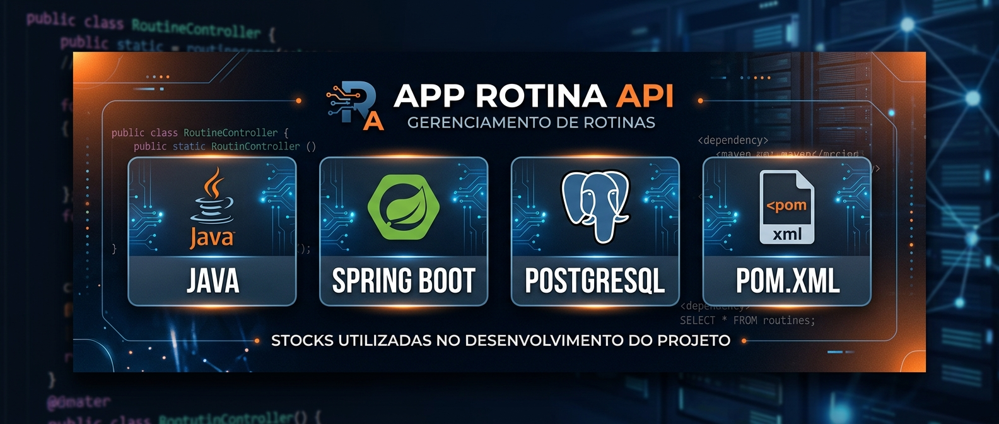

<p align="center">
  
</p>

<p align="center">
  <strong>API REST para gerenciamento de rotina, tarefas, lembretes e acompanhamento de consistência.</strong>
</p>

<p align="center">
  
  
  
</p>

---

# 📱 Sobre o projeto

O **App Rotina API** é uma API REST desenvolvida em **Java e Spring Boot** para fornecer a estrutura de um aplicativo de organização de rotina.

A aplicação permite que usuários criem e gerenciem suas tarefas diárias, definam horários para lembretes, acompanhem suas conclusões e mantenham uma sequência de atividades realizadas através do sistema de **Streak**.

O projeto foi desenvolvido com foco em **desenvolvimento backend, gerenciamento de tarefas, regras de negócio e integração com aplicações mobile**.

---

# ✨ Funcionalidades

## 📝 Gerenciamento de tarefas

O sistema permite organizar as atividades da rotina através de:

- ➕ Criação de tarefas
- ✏️ Edição de tarefas
- 🗑️ Exclusão de tarefas
- ✅ Conclusão de tarefas
- 📋 Visualização das tarefas
- 📅 Organização das atividades da rotina

---

## ⏰ Lembretes

Cada tarefa pode possuir um horário definido para lembrar o usuário de realizar determinada atividade.

```text
📝 Tarefa
   │
   ├── Nome
   ├── Descrição
   └── ⏰ Horário
          │
          ▼
      🔔 Lembrete
```

---

## 🔔 Notificações

A aplicação possui suporte à lógica de **notificações no celular**, permitindo que o usuário seja lembrado das tarefas programadas.

O objetivo é tornar a rotina mais prática e ajudar o usuário a manter consistência na realização das atividades.

---

# 🔥 Sistema de Streak

Um dos principais recursos do App Rotina é o acompanhamento da sequência de tarefas concluídas.

O **Streak** representa a consistência do usuário ao cumprir sua rotina.

Exemplo:

```text
       ROTINA

Segunda    ✅
Terça      ✅
Quarta     ✅
Quinta     ✅
Sexta      ❌

       🔥
    4 dias
   de Streak
```

Esse sistema permite transformar a conclusão das tarefas em um acompanhamento visual da evolução do usuário.

---

# 🏗️ Funcionamento

O fluxo principal da aplicação pode ser representado da seguinte forma:

```text
                📱 APP ROTINA
                     │
                     ▼
              📝 Criar tarefa
                     │
                     ▼
              ⏰ Definir horário
                     │
                     ▼
              🔔 Receber lembrete
                     │
                     ▼
              ✅ Concluir tarefa
                     │
                     ▼
                🔥 Atualizar
                   Streak
                     │
                     ▼
              📊 Acompanhar
                 rotina
```

---

# 🛠️ Tecnologias

| Tecnologia | Utilização |
|---|---|
| ☕ Java | Linguagem principal |
| 🌱 Spring Boot | Desenvolvimento da API |
| 🌐 REST API | Comunicação entre aplicação e backend |
| 🔔 Notifications | Sistema de lembretes e notificações |
| 🔥 Streak | Controle de sequência de tarefas |

---

# 🧠 Conceitos praticados

Durante o desenvolvimento do projeto foram trabalhados conceitos importantes de desenvolvimento backend:

- ☕ Programação orientada a objetos com Java
- 🌱 Spring Boot
- 🌐 Desenvolvimento de APIs REST
- 📡 Requisições HTTP
- 📝 CRUD de tarefas
- ⏰ Manipulação de horários
- 🔔 Sistema de notificações
- 🔥 Regras de negócio para Streak
- 🗂️ Organização de aplicações backend
- 🔗 Integração entre aplicação e API

---

# 🚀 Como executar

## 1. Clone o repositório

```bash
git clone https://github.com/Heitor-Souza-Pacheco/appRotina-API.git
```

Entre na pasta:

```bash
cd appRotina-API
```

---

## 2. Abra o projeto

Abra o projeto em uma IDE compatível com Java, como:

- IntelliJ IDEA
- Eclipse
- VS Code

Certifique-se de possuir o **JDK** compatível com a versão utilizada pelo projeto.

---

## 3. Execute a aplicação

Utilize a classe principal do Spring Boot para iniciar a aplicação.

Também é possível executar através do Maven, caso o projeto esteja configurado com Maven:

```bash
./mvnw spring-boot:run
```

No Windows:

```bash
mvnw.cmd spring-boot:run
```

---

# 📡 API

A API funciona como o backend responsável por processar as informações da rotina.

```text
┌──────────────────────┐
│      📱 Aplicativo   │
│       de Rotina      │
└──────────┬───────────┘
           │
           │ HTTP / REST
           ▼
┌──────────────────────┐
│    ⚙️ App Rotina API │
│                      │
│    Java + Spring     │
└──────────┬───────────┘
           │
           ▼
      📝 Tarefas
      ⏰ Lembretes
      🔥 Streak
      🔔 Notificações
```

---

# 📂 Estrutura do projeto

A estrutura pode ser organizada de acordo com as responsabilidades da aplicação:

```text
appRotina-API/
│
├── assets/
│   └── approtinabanner.png
│
├── src/
│   ├── main/
│   │   ├── java/
│   │   └── resources/
│   │
│   └── test/
│
├── .gitignore
├── README.md
└── ...
```

---

# 🎯 Objetivos do projeto

O projeto tem como objetivo desenvolver uma solução capaz de auxiliar usuários na organização de suas atividades diárias.

Entre os principais objetivos estão:

- Melhorar a organização da rotina.
- Facilitar o gerenciamento de tarefas.
- Criar lembretes para atividades importantes.
- Incentivar a consistência através do Streak.
- Praticar desenvolvimento de APIs REST.
- Desenvolver regras de negócio utilizando Java e Spring Boot.
- Criar uma base backend para uma aplicação mobile.

---

# 📚 Aprendizados

O desenvolvimento do App Rotina proporcionou experiência prática na criação de uma aplicação backend voltada para um problema real do cotidiano.

Entre os principais aprendizados estão:

- Desenvolvimento de APIs utilizando Spring Boot.
- Criação e gerenciamento de tarefas.
- Implementação de regras de negócio.
- Manipulação de datas e horários.
- Desenvolvimento de sistemas de lembretes.
- Implementação de lógica de Streak.
- Organização de um projeto backend.
- Comunicação entre aplicações através de uma API REST.

---

# 🔮 Próximos passos

Algumas possibilidades de evolução do projeto:

- [ ] Melhorar o sistema de notificações.
- [ ] Adicionar diferentes tipos de tarefas.
- [ ] Criar categorias para as atividades.
- [ ] Adicionar estatísticas de produtividade.
- [ ] Criar acompanhamento semanal e mensal.
- [ ] Melhorar o sistema de Streak.
- [ ] Adicionar autenticação de usuários.
- [ ] Implementar testes automatizados.
- [ ] Documentar a API com Swagger/OpenAPI.
- [ ] Realizar deploy da API.

---

# 👨‍💻 Desenvolvedor

## Heitor Souza Pacheco

Estudante de Ensino Médio Técnico em Informática e desenvolvedor interessado em **Java, Spring Boot, APIs REST e desenvolvimento de software**.

<p align="center">
  <a href="https://github.com/Heitor-Souza-Pacheco">
    
  </a>
  <a href="https://linkedin.com/in/heitor-souza-pacheco">
    
  </a>
</p>

---

<p align="center">
  ⭐ Se este projeto foi útil ou interessante, considere deixar uma estrela!
</p>
